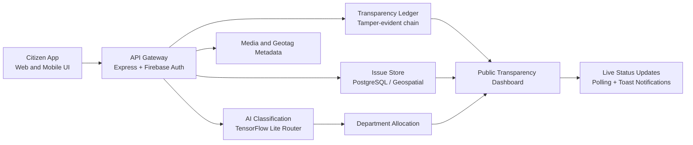

## CCIRS System Architecture

### Data Path Summary

1. Citizen submits text, photos, voice note, and location.
2. API validates consent and authentication.
3. AI classifies issue and routes it to the responsible department.
4. Issue and geospatial metadata are persisted.
5. Ledger events are recorded for timeline integrity.
6. Dashboard and transparency feed render live progress and alerts.
